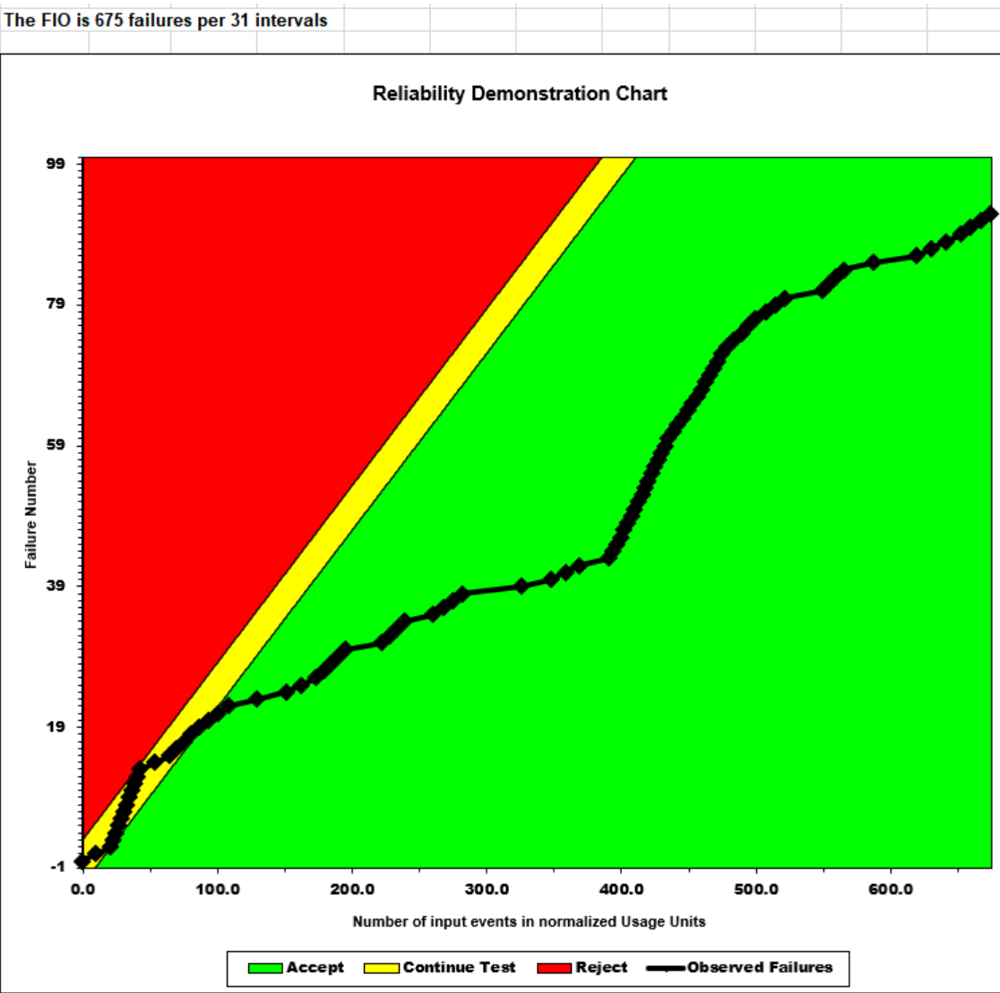

**SENG 637- Dependability and Reliability of Software Systems***

**Lab. Report \#5 – Software Reliability Assessment**

| Group: 9               |
| ---------------------- |
| Moaz Barakat           |
| Juan Celis             |
| Bogdan Constantinescu  |
| Andy Guevara           |
| Billy Sidharta         |

# Introduction

This assignment is about understanding the basics of software reliability assessment as well as the analysis of integration test data using reliability assessment tools. In this assignment specifically, we will use the provided failure dataset for both Reliability Growth Testing and Reliability Demonstration Chart. 

The following were used to complete this assignment:

- Reliability Growth Testing (RGT): `C-SFRAT`
- Reliability Demonstration Chart (RDC): `RDC-11 (an EXCEL worksheet and macro)`

Additionally, the assignment aims to help us understand how to measure the failure rate, MTTF and reliability of the SUT through analyzing the test data.

# Assessment Using Reliability Growth Testing 

We decided to use the Covariate Software Failure And Reliability Analysis Tool (C-SFRAT) since it was:
- Simple to use
- Cleaner UI than the alternative START tool. 

After importing, the MVF graph below shows the imported data:

## Result of model comparison (selecting top two models)

Initially, we selected all the hazard functions and all covariates for comparison. The graph below shows the results and the model fits:

Subsequently, these models were then analyzed to determine the top two models. Using C-SFRAT model comparison tab, we were able to identify the two top models by selecting the lowest Akaike Information Criterion (AIC) which balances the goodness of the fit with the complexity of the model as well as the Bayseian Information Criterion (BIC). The lower the values of AIC/BIC, the better the trade-off between model fit and complexity. 

The table below shows the comparison of all the models sorted by the lowest AIC/BIC.

As shown in the graph above the top two models selected are:

- **DW3(F)** - Discrete Weibull Type III (DW3) model covariate F
    - AIC = 122.199, BIC = 127.935
- **GM(F)** - Geometric model covariate F
    - AIC = 125.323, BIC = 129.625

It is also worth to note a third model. Using the same criterion (lowest AIC/BIC) but also considering and sorting by the lowest Sum of Squares Errors (SSE), the IFR Generalized Salvia & Bollinger **(IFRGSB) with E,F,C covariate** may also be a good model to highlight as well. However for analysis, we decided to only use DW3(F) and GM(F). 

Showing top two models + notable third on entire dataset:

MVF graph:

Intensity graph:

## Result of range analysis (an explanation of which part of data is good for proceeding with the analysis)

As shown in the graphs above, we can observe an initial steep curve which corresponds to an infant mortality phase as per lecture notes. Subsequently, we can also observe a phase of stability in the system's performance after interval 4. As indicated by the intensity graph, some locations are much higher/lower than they should be which suggests the results can be improved by performing a range analysis.

Furthermore, we tested the two models with various ranges of the subset failure data. Looking at the graph, it looks like the results are the closest around 20-21 interval range. The best yielding result was found by:
- Using 21 of the 31 of the full set (~67%) 
- Setting the prediction as follows:
    - E = 0
    - F = 20
    - C = 0
    - Number of intervals to predict = 10

These setting improved the two models AIC/BIC to:
- DW3(F): [AIC: 122.199 → 83.817], [BIC: 127.935 → 87.995]
- GM(F): [AIC: 125.323 → 88.499], [BIC: 129.625 → 91.632]

Model comparison table:

MVF/Time to Failure graph:

Intensity graph:

The improvements can be directly observed in the graphs above when compared to the original graphs in various ranges. Although there are still imperfections and discrepancies, the results more closely match the model estimation after applying the range analysis.

## A discussion on decision making given a target failure rate

The dataset we are given showed a higher failure rate during infant mortality, which can be expected. Subsequently in the next phase, we can see a decrease in the failure rate indicating improved overall system reliability. There are multiple considerations for assessing the acceptable range of failure rate for the provided test data. In general terms, if the System Under Test (SUT) <= of the target failure rate, the assumption is that the system is operational and functioning properly. Conversely, if its > the target rate, additional bug fixing may be required. 

From our analysis above, the following table shows the comparison of the models to interval 31:

This table above can be used to calculate the failure rate and MTTF. At interval 31 (last interval):
- DW3 (F):
    - Failure Rate: ~91/31 = `2.94` Failures/Interval
    - MTTF: 1/(~91/31) = `0.341` intervals
- GM (F):
    - Failure Rate: ~90/31 = `2.90` Failures/Interval
    - MTTF: 1/(~90/31) =  `0.344` intervals

Compared to original input failure data:
- Failure Rate: ~92/31 = `2.96` Failures/Interval
- MTTF: 1/(~92/31) = `0.337` intervals

This indicates that the acceptable failures/interval is ~3. Similar to the calculation above, we can predict future failure rates to determine if the number of failures is acceptable or not.

Failures are inevitable for all SUT scenarios and its crucial to set expectation accordingly. Setting unrealistic low failure rate can result in inefficient resource allocation and conversely unrealistic high failure rate could have dire consequences as well. When making decisions regarding the targeted failure rate during reliability growth testing, it worth to consider determining the acceptable targeted failure rate for the SUT being evaluated. This determination can be set from expected failure rates set by users/clients or industry standards while taking into account factors such as project-specific requirements and safety. Finally, it is important to monitor the trend of the failure rate as this could lead to improved insights.

## A discussion on the advantages and disadvantages of reliability growth testing

Below are some of the advantages of RGT:

### Advantages of RGT:

- Various models with different covaraiates can be compared and used to access the SUT
- Allows users to identify reliability issues by analyzing failure data
- Different metrics/criteria such as AIC/BIC/SSE and others can be used for tailored analysis
- Allows users to test the overall reliability of the system prior to deployment

Below are some of the disadvantages of RGT:

### Disadvantages of RGT:

- Limited software(s) with little or poor documentation
- Requires large amount of data if we want to accurately access the reliability of the SUT
- Performance is based on model selection which could be sensitivity for ranges of data leading to undesirable results
- Can be time/cost intensive

# Assessment Using Reliability Demonstration Chart 

We utilized the RDC-11 (an EXCEL worksheet and macro) for this part of the assignment. After exploring the workbook and getting familiarized with its usage, we realized the need to create a new modified dataset that can be expressed in terms of cumulative failure count. This was done by first converting the `FC` faults/interval column. This yielded 92 rows or failures. Assuming a uniform distribution, we also calculated the time between and total time. The following shows the sample calculation for the first two rows:

- 1/# failures (in FC column) = 1/2 = 0.5
- T=1, FC=2 becomes two rows with: failure 1 = 0.5 , failure 2 = 0.5
- Cumulative total always adds up to the interval number as its uniformly distributed across the interval

The following table shows the first 11 rows of the modified dataset:

This was then provided as input to the excel workbook. It is worth to mention that we kept the risk profile the same, for reference this was kept as:

- Discrimination Ratio (gamma) - `2`
- Developer's Risk (alpha) - `0.1`
- User's Risk (beta) - `0.1`

## Explain your evaluation and justification of how you decide the MTTFmin + 3 plots

Initially, we decided to check the original data of 92 failures/31 intervals. This yielded a graph which was mostly in the rejected reason. We determined the value of MTTFmin by adjusting the Failure Intensity Objective (FIO) so that we can sustain and not dip into the rejected region. Through trial and error, the value was estimated to be roughly around `675` failures per 31 intervals. See below calculation for failure rate, MTTF, FIO and their associated graphs:

Below is the graph of MTTFmin:

- FIO = `675` failures per 31 intervals
- Failure Rate: ~675/31 = `21.77` Failures/Interval
- MTTF: 1/(~675/31) =  `0.046` intervals
- Results: Minimum Acceptable - no dip into red region

Below is the graph for twice MTTFmin (FIO = 675*2 = 1350)

- FIO = `1350` failures per 31 intervals
- Failure Rate: ~1350/31 = `43.55` Failures/Interval
- MTTF: 1/(~1350/31) =  `0.023` intervals
- Results: Acceptable - mostly all green small dip into yellow

Below is the graph for half MTTFmin (FIO = 675/2 = 337.5)

- FIO = `337.5` failures per 31 intervals
- Failure Rate: ~1350/31 = `10.89` Failures/Interval
- MTTF: 1/(~1350/31) =  `0.092` intervals
- Results: Unacceptable - dips into red

## A discussion on the advantages and disadvantages of RDC

Below are some of the advantages of RDC:

### Advantages of RDC:

- Graphical representation and color codes makes it easy to determine the acceptance/continue/reject regions and results
- User risk profiles are adjustable which allows for flexibility in analysis
- As per lecture notes, RDC is cost and time efficient way of analyzing reliability

Below are some of the disadvantages of RDC:

### Disadvantages of RDC:

- Complex and the minimal documentation makes it difficult to setup
- Adjusting the output graph to visualize different results is hectic
- Cannot be used for accurate quantitative analysis of the SUT

# Comparison of Results

The lab introduced two separate approaches to software reliability assessment. In the first part, we used C-SFRAT for RGT and we were able to pick the top two models DW3(F) and GM(F) based on the lowest AIC/BIC criterion. Moreover, we performed range analysis to improve the model fit which allowed us to more accurately predict failure rates for future intervals. Using the top model DW3(F), we were able to determine the MTTF of the SUT to be `0.341` interval and the failure rate `2.94` Failures/Interval. 

In the next part of the lab, we used the RDC as a visual tool to determine the MTTFmin. The tool was also used to observe when  failures dipped into the rejected regions in a graphically helpful manner. In this analysis, the MTTFmin was determined to be `0.046` which corresponds to `21.77` Failures/Interval.

Both of the results obtained could be used to determine if the SUT passes or if there is more work to be done. The answer also depends on the application of the software and considering factors such as project requirements and other constrains. Comparing the two techniques, both have their advantages and their disadvantages as described in the above section. Ultimately, both could be used for software reliability assessment and provide important insights about the SUT and its testing.

# Discussion on Similarity and Differences of the Two Techniques

Below are some of the similarities between the two techniques:

### Similarities

- Can be used for software reliability assessment
- Used the same input failure data to analyze performance and quality
- Provides insight related to the system's failure behavior
- Makes use of failure rates and MTTF metrics

Below are some of the differences between the two techniques:

### Differences

- RGT can be used for reliability prediction, RDC can be used for checking MTTFmin and SUT acceptance
- RGT assessment revolves around using models whereas RDC revolves around using risk profiles
- Cost and time differences. RGT generally is associated with more cost/time

# How the team work/effort was divided and managed

Initially, we spent time checking out the tools that we will be using as a team. The first group focused on RGT while the second group focused on the RDC. Eventually, all group members helped each other out since the documentation was limited for both tools used. Once both groups have completed their sections, we scheduled a peer review meeting to go over the issues found from each group. The meeting was also used to discuss results, formatting, and removed any duplicate issues that were found by both teams.

Group 1: Bogdan and Andy

Group 2: Juan, Billy and Moaz

# Difficulties encountered, challenges overcome, and lessons learned

In this assignment, none of our group members had previous experience with using the tools suggested in both parts of the lab. There was a learning curve to learn how the RDT and RGC tools functions, get aquatinted with the user interface and how to use it effectively for the lab. Ultimately, we spent a lot of time figuring out thing through trial and error as the documentation of the tools was minimal. Additionally, we also faced an issue in adjusting the views of RDC graphs as it was only limited to 16 inputs. This is when we realized that we had to adjust a few things to get it working. We ultimately learned how to adjust it and continued to use the tool effectively. The biggest lesson learned is that tool documentation really matters! One could have a very powerful tool but without knowing how to use it effectively, it can be practically useless. 

# Comments/feedback on the lab itself

We all thought the lab was very helpful as it exposed us to software reliability assessment using different tools. Recommendation would be to provide more instructions in lab for both parts as the tools used have very little or poor documentation.
